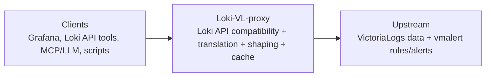

# Loki-VL-proxy

[](https://github.com/ReliablyObserve/Loki-VL-proxy/actions/workflows/ci.yaml)
[](https://github.com/ReliablyObserve/Loki-VL-proxy/actions/workflows/compat-loki.yaml)
[](https://github.com/ReliablyObserve/Loki-VL-proxy/actions/workflows/compat-drilldown.yaml)
[](https://github.com/ReliablyObserve/Loki-VL-proxy/actions/workflows/compat-vl.yaml)
[](https://github.com/ReliablyObserve/Loki-VL-proxy/releases)
[](LICENSE)

Use **Grafana Loki clients** with **VictoriaLogs** through a **Loki-compatible read proxy**.

No custom Grafana datasource plugin. No sidecar translation service. One small static binary.

## Why Teams Use It

- **Drop-in Loki frontend**: Keep Grafana Explore, Drilldown, dashboards, and Loki API tooling.
- **VictoriaLogs backend economics**: Query VL while preserving Loki client experience.
- **Strict compatibility contracts**: Default 2-tuple responses, explicit 3-tuple only when `categorize-labels` is requested.
- **Production guardrails**: Tenant isolation, bounded fanout, circuit breaking, rate limits, and safe caching.
- **Fast repeat reads**: Tiered cache with optional disk and fleet peer reuse.

## High-Level Flow



## Product Scope

Loki-VL-proxy is intentionally a **read/query proxy**.

- In scope: Loki-compatible query/read endpoints, metadata paths, rules/alerts read views.
- Out of scope: ingestion pipeline ownership (`push` is blocked), rule write lifecycle.

Use VictoriaLogs-side ingestion (`vlagent`, OTLP, native JSON/OTel, Loki-push-to-VL) and query that data through this proxy.

## Quick Start

```bash
# Binary
go build -o loki-vl-proxy ./cmd/proxy
./loki-vl-proxy -backend=http://victorialogs:9428

# Docker
docker build -t loki-vl-proxy .
docker run -p 3100:3100 loki-vl-proxy -backend=http://victorialogs:9428

# Compose (includes Grafana)
docker-compose up -d
```

### Helm

```bash
helm install loki-vl-proxy oci://ghcr.io/reliablyobserve/charts/loki-vl-proxy \
  --version <release> \
  --set extraArgs.backend=http://victorialogs:9428
```

### Grafana Datasource

```yaml
datasources:
  - name: Loki (via VL proxy)
    type: loki
    access: proxy
    url: http://loki-vl-proxy:3100
    jsonData:
      httpHeaderName1: X-Scope-OrgID
    secureJsonData:
      httpHeaderValue1: team-alpha
```

## Compatibility Guarantees (Operator-Relevant)

- **Loki tuple safety**:
  - default requests return strict `[timestamp, line]`
  - `X-Loki-Response-Encoding-Flags: categorize-labels` enables Loki 3-tuple metadata mode
- **Cache mode segregation**:
  - query cache keys are split by tuple mode to prevent 3-tuple/2-tuple cross-contamination
- **Grafana-first behavior**:
  - compatibility tracks continuously verify Loki API, Logs Drilldown, and VictoriaLogs integration

## Performance Model

- Multi-layer cache: compatibility-edge + memory + optional disk + optional peer cache.
- Query-range windowing: historical range reuse with adaptive bounded parallel fetch.
- Built-in metrics/logs for tuning cache hit ratio, backend latency, fanout behavior, and tenant/client pressure.

See [Performance](docs/performance.md), [Fleet Cache](docs/fleet-cache.md), [Scaling](docs/scaling.md), and [Observability](docs/observability.md).

## Documentation Map

### Start Here
- [Getting Started](docs/getting-started.md)
- [Configuration](docs/configuration.md)
- [Operations](docs/operations.md)

### Architecture & Behavior
- [Architecture](docs/architecture.md)
- [API Reference](docs/api-reference.md)
- [Translation Reference](docs/translation-reference.md)
- [Security](docs/security.md)

### Compatibility & Testing
- [Compatibility Matrix](docs/compatibility-matrix.md)
- [Loki Compatibility](docs/compatibility-loki.md)
- [Logs Drilldown Compatibility](docs/compatibility-drilldown.md)
- [VictoriaLogs Compatibility](docs/compatibility-victorialogs.md)
- [Testing](docs/testing.md)

### SRE / Runbooks
- [Observability](docs/observability.md)
- [Alert Runbooks](docs/runbooks/alerts.md)
- [Deployment Best Practices](docs/runbooks/deployment-best-practices.md)

### Migration & Project Info
- [Rules And Alerts Migration](docs/rules-alerts-migration.md)
- [Known Issues](docs/KNOWN_ISSUES.md)
- [Roadmap](docs/roadmap.md)
- [Changelog](CHANGELOG.md)

## License

Apache License 2.0. See [LICENSE](LICENSE).
